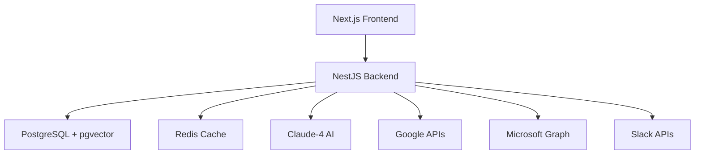

# Aurelius AI Personal Assistant 🧠

<div align="center">

**Your Digital Chief of Staff - Transforming to-do lists into done lists**

[](https://github.com/your-org/aurelius/actions/workflows/ci.yml)
[](https://github.com/your-org/aurelius/actions/workflows/codeql.yml)
[](https://github.com/your-org/aurelius/actions/workflows/sonarqube.yml)
[](LICENSE)

[🌐 Live Demo](https://aurelius.ai) • [📖 Documentation](./docs) • [🚀 Get Started](#quick-start)

</div>

## 🎯 What is Aurelius?

Aurelius is a revolutionary AI Personal Assistant that acts as your **digital chief of staff**, providing proactive task execution, deep workspace integration, and perfect memory of all interactions. Unlike traditional task managers, Aurelius doesn't just track what you need to do—it actively works to get things done.

### ✨ Core Value Proposition

- **🧠 Perfect Memory AI**: Remembers every detail, context, and preference across all interactions
- **⚡ Proactive Execution**: Tasks complete themselves while you focus on strategic work
- **🔗 Deep Integration**: Seamlessly works with Google Workspace, Microsoft 365, Slack, and more
- **📊 AI-Powered Insights**: Strategic briefings and intelligent suggestions like a human assistant
- **🔒 Enterprise Security**: Bank-level encryption with OAuth and JWT authentication

## 🏗️ Architecture Overview

Aurelius is built as a modern full-stack application with enterprise-grade architecture:



### 🛠️ Technology Stack

#### Frontend (Next.js 14)
- **Framework**: Next.js 14 with App Router & Turbo
- **Styling**: Tailwind CSS with custom UI components
- **State**: Zustand for global state management
- **Auth**: NextAuth.js v5 with OAuth providers
- **3D**: Three.js with React Three Fiber for brain visualization
- **Real-time**: Socket.io for live updates

#### Backend (NestJS)
- **Framework**: NestJS with modular architecture
- **Database**: PostgreSQL 15 with pgvector for AI embeddings
- **Cache**: Redis 7 with Bull queue for background jobs
- **AI**: Claude-4 Sonnet integration via custom AI Gateway
- **Auth**: JWT with Passport (Google, Microsoft OAuth)
- **Real-time**: Socket.io WebSocket connections
- **Queue**: Bull for async task processing

#### Infrastructure
- **Frontend Deployment**: Vercel with automatic deployments
- **Backend Deployment**: Railway with PostgreSQL + Redis
- **Monitoring**: Comprehensive logging and health checks
- **Security**: AES-256 encryption, rate limiting, CSRF protection

## 🚀 Quick Start

### Prerequisites

- **Node.js**: 18.0.0 or higher
- **npm**: 8.0.0 or higher  
- **PostgreSQL**: 15+ with pgvector extension
- **Redis**: 7+ for caching and queues

### 1. Clone & Install

```bash
git clone https://github.com/your-org/aurelius.git
cd aurelius
npm install
```

### 2. Environment Setup

```bash
# Copy environment templates
cp backend/.env.example backend/.env
cp frontend/.env.example frontend/.env

# Configure your environment variables
# See SETUP.md for detailed configuration guide
```

### 3. Database Setup

```bash
# Start PostgreSQL and Redis (or use Docker)
docker run -d --name postgres -p 5432:5432 -e POSTGRES_PASSWORD=postgres postgres:15
docker run -d --name redis -p 6379:6379 redis:7-alpine

# Run database migrations
cd backend
npm run prisma:migrate
npm run prisma:seed
```

### 4. Start Development

```bash
# Start both frontend and backend
npm run dev

# Or start individually
npm run dev:frontend  # http://localhost:3000
npm run dev:backend   # http://localhost:3001
```

## 🎛️ Available Scripts

### Root Level
- `npm run dev` - Start both frontend and backend concurrently
- `npm run build` - Build both applications for production
- `npm run lint` - Run ESLint on both applications
- `npm run test` - Run all tests (frontend + backend)

### Backend Specific
- `npm run start:dev` - Start NestJS with hot reload
- `npm run build:full` - Complete build with validation and health checks
- `npm run test:cov` - Run tests with coverage
- `npm run test:e2e` - Run end-to-end tests
- `npm run prisma:studio` - Open Prisma Studio GUI

### Frontend Specific
- `npm run type-check` - TypeScript compilation check
- `npm run test:watch` - Run Jest tests in watch mode

## 📊 Features & Capabilities

### 🤖 AI-Powered Automation
- **TASA Loop**: Trigger → Analysis → Suggestion → Action proactivity engine
- **Perfect Memory**: Vector embeddings for semantic search and context retention
- **Intelligent Caching**: Redis-based caching with smart invalidation strategies
- **Cost Optimization**: Intelligent batching and semantic deduplication

### 🔌 Integrations
- **Google Workspace**: Gmail, Calendar, Drive, Tasks (✅ Implemented)
- **Microsoft 365**: Outlook, Calendar, OneDrive (🔄 Planned)
- **Slack**: Messaging and notifications (🔄 Planned)  
- **Jira**: Issue tracking (🔄 Planned)

### 🎨 User Experience
- **Dashboard-First Design**: 12-column grid with intelligent widgets
- **Glassmorphism UI**: Apple-inspired design with smooth animations
- **3D Brain Visualization**: Interactive Floating Action Button
- **Responsive Design**: Mobile-first approach (320px to desktop)
- **Real-time Updates**: WebSocket-powered live data

### 🔐 Security & Compliance
- **OAuth 2.0**: Google and Microsoft authentication
- **JWT Tokens**: 15-minute expiry with refresh token rotation
- **Encryption**: AES-256 for sensitive data at rest
- **Rate Limiting**: 100 requests/minute per user
- **CSRF Protection**: Token-based protection for state-changing requests
- **Input Validation**: Zod schemas and class-validator

## 💰 Pricing & Plans

### Pro - $50/month ($45/month annually)
- 1,000 AI actions/month
- 1 workspace + 3 integrations
- Basic automation
- Perfect Memory AI
- Email & chat support

### Max - $100/month ($90/month annually)
- 3,000 AI actions/month
- Unlimited integrations
- Cross-platform workflows
- Advanced AI insights
- Custom automations
- Priority support

### Teams - $70/user/month ($63/user/month annually)
- 2,000 AI actions/user/month
- Shared workspace access
- Admin controls & analytics
- Team performance insights
- 24/7 priority support
- Enterprise security

## 🧪 Testing & Quality

### Test Coverage
- **Backend**: Unit tests + E2E tests with Jest
- **Frontend**: Component tests with Jest + Testing Library
- **Integration**: API endpoint testing
- **E2E**: User workflow testing

### Quality Assurance
- **SonarQube**: Code quality and security analysis
- **CodeQL**: Security vulnerability scanning
- **ESLint**: Strict TypeScript linting
- **Lighthouse**: Performance monitoring (80%+ score target)

### CI/CD Pipeline
- **GitHub Actions**: Comprehensive CI/CD with 5 workflows
- **Automated Testing**: Full test suite on every PR
- **Security Scanning**: Snyk, CodeQL, and npm audit
- **Performance**: Bundle analysis and Lighthouse CI

## 📈 Performance & Monitoring

### Performance Targets
- **API Response**: <200ms for most endpoints
- **Frontend Load**: <3s initial load, 60fps animations
- **Lighthouse Score**: >90 across all metrics
- **WebSocket Latency**: <100ms real-time updates

### Monitoring Stack
- **Error Tracking**: Comprehensive logging with Winston
- **Health Checks**: Automated endpoint monitoring
- **Performance**: Real-time metrics and alerting
- **Usage Analytics**: AI action tracking for billing

## 🤝 Contributing

We welcome contributions! Please see our [Contributing Guide](CONTRIBUTING.md) for details.

### Development Workflow
1. Fork the repository
2. Create a feature branch (`git checkout -b feature/amazing-feature`)
3. Make your changes
4. Run tests (`npm run test`)
5. Commit your changes (`git commit -m 'Add amazing feature'`)
6. Push to branch (`git push origin feature/amazing-feature`)
7. Open a Pull Request

### Code Standards
- **TypeScript**: Strict mode with comprehensive typing
- **ESLint**: Follow existing configuration
- **Prettier**: Automated code formatting
- **Conventional Commits**: Use conventional commit messages
- **Testing**: Maintain >80% test coverage

## 📚 Documentation

- [🏗️ Architecture Guide](./docs/ARCHITECTURE.md)
- [⚙️ Setup Guide](./docs/SETUP_GUIDE.md)
- [🔧 Backend API](./backend/README.md)
- [🎨 Frontend Components](./frontend/README.md)
- [🔌 Integrations](./docs/INTEGRATIONS.md)

## 🛡️ Security

Aurelius takes security seriously. For security issues, please email security@aurelius.ai instead of opening a public issue.

### Security Features
- OAuth 2.0 authentication with major providers
- JWT tokens with short expiry and rotation
- AES-256 encryption for sensitive data
- Rate limiting and CSRF protection
- Regular security audits and updates

## 📞 Support & Community

- **Documentation**: [docs.aurelius.ai](https://docs.aurelius.ai)
- **Support**: [support@aurelius.ai](mailto:support@aurelius.ai)
- **Status Page**: [status.aurelius.ai](https://status.aurelius.ai)
- **Community**: [community.aurelius.ai](https://community.aurelius.ai)

## 📄 License

Copyright © 2024 Aurelius AI. All rights reserved.

This software is proprietary and confidential. Unauthorized copying, distribution, or use is strictly prohibited.

---

<div align="center">

**Built with ❤️ by the Aurelius team**

[Website](https://aurelius.ai) • [Blog](https://aurelius.ai/blog) • [Twitter](https://twitter.com/aurelius_ai)

</div>